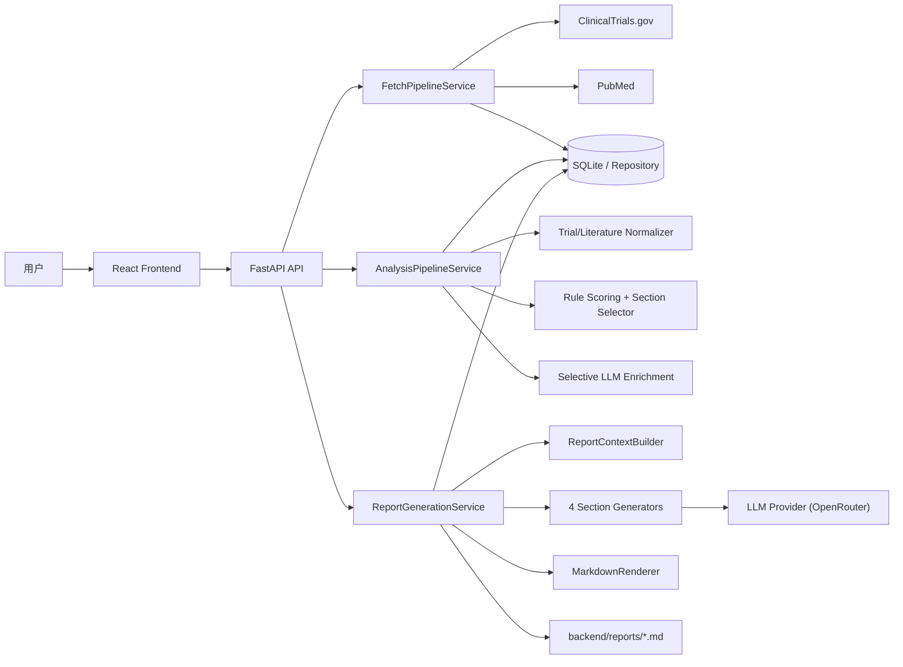
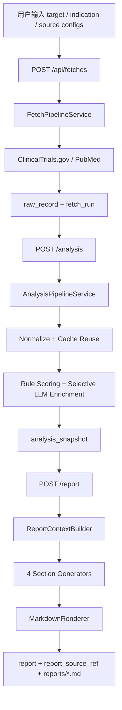

# 医疗情报系统架构设计方案

## 1. 文档目标

本文档基于 [总体技术方案](./总体技术方案.md) 与 [医疗情报系统需求描述](./医疗情报系统需求描述.md)，并结合当前仓库已经完成的实现，对系统架构进行实施后说明。重点回答以下问题：

- 系统整体架构与各模块职责
- 关键技术选型及理由
- 数据从采集到报告输出的完整流转过程
- 当检索结果量很大、超过 LLM 上下文窗口时的处理方式
- 主要技术风险及应对策略

当前仓库已经打通 `阶段 1 采集 -> 阶段 2 分析 -> 阶段 3 报告生成` 的闭环，因此本文档不再停留在“建议设计”，而是以“当前已落地架构”为主，兼顾后续演进方向。

## 2. 当前实现概览

当前系统采用“前后端分离 + 后端模块化单体”的实现形态，核心链路如下：

1. 前端提交靶点、适应症与来源配置。
2. 后端调用 `ClinicalTrials.gov` 和 `PubMed` 完成多源采集。
3. 原始记录入库后，执行标准化、规则打分、可选 LLM 增强与分析快照构建。
4. 报告生成服务基于分析快照按四个章节分别调用 LLM。
5. 最终输出 Markdown 报告、章节来源引用和 warning 信息，并保存到数据库与本地报告目录。

当前已落地的主要能力：

- 多源采集：`ClinicalTrials.gov`、`PubMed`
- 持久化对象：`fetch_run`、`raw_record`、标准化记录、LLM 增强结果、分析快照、报告、来源引用
- 分析能力：规则打分、章节证据选择、覆盖度判断、统计聚合
- 报告能力：四章节 Markdown 报告、失败兜底、来源可追溯
- UI 能力：单页工作台完成采集、分析、报告生成、状态查看和 Markdown 下载
- 部署方式：`Docker Compose` 同时启动前后端，本地挂载保留代码、数据库和报告文件

## 3. 系统整体架构与模块职责

### 3.1 逻辑架构

### 3.2 部署架构

当前 `docker-compose.yml` 对应两个运行容器：

- `backend`
  - 运行 `FastAPI + Uvicorn`
  - 暴露 `8000`
  - 通过挂载 `./backend:/app` 保留数据库文件、报告文件和代码改动
- `frontend`
  - 运行 `React + Vite`
  - 暴露 `5173`
  - 依赖后端健康检查成功后启动

这意味着当前是“单后端进程 + 单前端开发服务”的原型部署形态，适合演示、联调和小规模内部使用。

### 3.3 后端模块职责

| 模块 | 当前实现 | 职责说明 |
| --- | --- | --- |
| `app/api` | `router.py`、`routes/fetches.py`、`schemas/*`、`deps.py` | 提供 HTTP 接口、请求响应模型、依赖注入 |
| `app/orchestration` | `fetch_pipeline.py`、`analysis_pipeline.py`、`report_generation.py` | 编排采集、分析和报告生成三条主链路 |
| `app/connectors` | `clinicaltrials/*`、`pubmed/*` | 负责外部数据源请求、分页、解析、原始记录构建 |
| `app/normalize` | `trial_normalizer.py`、`literature_normalizer.py` | 将原始记录标准化为稳定业务对象，并抽取稳定 key |
| `app/analyze` | `scoring.py`、`selector.py`、`stats.py`、`llm_enrichment.py`、`bundle_builder.py` | 规则打分、LLM 增强、章节证据筛选、统计聚合、分析快照构建 |
| `app/report` | `context_builder.py`、四个 section generator、`markdown_renderer.py` | 组织章节上下文、调用 LLM 生成分章节内容、拼装 Markdown |
| `app/llm` | `client.py`、`factory.py`、`providers/*` | 屏蔽模型厂商差异，当前落地 `OpenRouterProvider` |
| `app/repository` | 多个 repository + SQLAlchemy models | 持久化 fetch run、原始记录、标准化记录、LLM 增强、分析快照、报告与来源引用 |
| `app/domain` | `fetching.py`、`analysis.py`、`report.py` | 定义跨模块传递的核心领域对象 |
| `app/infra` | `settings.py`、`db.py`、`logging.py`、`exceptions.py`、`http.py` | 提供配置、数据库、日志、中间件、异常与 HTTP 基础设施能力 |

### 3.4 前端模块职责

| 模块 | 当前实现 | 职责说明 |
| --- | --- | --- |
| `frontend/src/pages/HomePage.tsx` | 单页主工作台 | 收集查询参数，串联阶段 1/2/3 操作，展示分析摘要、图表、报告与 warning |
| `frontend/src/services/fetchApi.ts` | API 访问层 | 封装采集、分析、报告相关接口 |
| `frontend/src/services/healthApi.ts` | 健康检查调用 | 检查后端可用性 |
| `frontend/src/types/*` | 类型定义 | 维护前后端交互结构的 TypeScript 类型 |
| `frontend/src/router.tsx` | 路由入口 | 保留页面扩展能力，当前以前台工作台为主 |

### 3.5 当前对外接口

当前 API 以 `/api/fetches` 为主入口，形成分阶段闭环：

- `POST /api/fetches`
  - 创建一次多源采集任务并返回 `fetch_run`
- `GET /api/fetches/{fetch_run_id}`
  - 查询采集任务状态
- `GET /api/fetches/{fetch_run_id}/records`
  - 查询原始记录
- `POST /api/fetches/{fetch_run_id}/analysis`
  - 构建分析快照
- `GET /api/fetches/{fetch_run_id}/analysis`
  - 查询分析快照
- `POST /api/fetches/{fetch_run_id}/report`
  - 生成报告
- `GET /api/fetches/{fetch_run_id}/report`
  - 查询报告
- `GET /api/fetches/{fetch_run_id}/report/sources`
  - 查询报告引用来源

### 3.6 持久化对象分层

当前数据库中的关键持久化对象可分为四层：

| 层级 | 主要对象 | 作用 |
| --- | --- | --- |
| 任务层 | `fetch_run` | 记录一次查询任务的目标、来源配置、状态、warning 和统计摘要 |
| 原始证据层 | `raw_record` | 保留外部来源返回的原始证据，用于追溯、调试和重新分析 |
| 分析中间层 | `normalized_trial_record`、`normalized_literature_record`、`trial_llm_enrichment`、`literature_llm_enrichment`、`analysis_snapshot` | 保存标准化结果、增强结果和可复用的分析快照 |
| 报告产物层 | `report`、`report_source_ref` | 保存最终 Markdown 报告及其章节级来源引用 |

这种分层保证了系统不是“一次性生成文本”，而是“先沉淀证据，再生成报告”。

### 3.7 领域模型设计概要

本项目的领域模型设计不是围绕“页面字段”来组织，而是围绕“医学情报处理链路中的信息对象”来组织。也就是说，系统会把不同阶段真正需要复用的信息沉淀为稳定对象，再由后续模块继续加工。这种设计直接体现了项目较强的信息提取能力。

#### 3.7.1 领域模型分层

当前核心领域对象可以概括为以下几层：

| 层级 | 核心对象 | 设计目的 |
| --- | --- | --- |
| 查询与采集层 | `TargetQuery`、`FetchRun`、`RawRecord`、`SourceFetchSummary` | 描述用户查询意图、来源配置、采集任务状态和原始证据 |
| 标准化实体层 | `NormalizedTrialRecord`、`NormalizedLiteratureRecord`、`SourceTrace`、`NormalizedDate` | 将多源异构数据压缩为稳定、可计算、可追溯的医学领域对象 |
| 语义增强层 | `TrialLLMEnrichment`、`LiteratureLLMEnrichment`、`DimensionInsight`、`EvidenceSnippet`、各类 `ScoreBreakdown` | 在规则提取之上补充记录级语义理解、主题线索和证据片段 |
| 分析聚合层 | `GlobalAnalysisStats`、`CoverageSnapshot`、各类 `*Facts`、`SectionInputBundle`、`AnalysisReadyBundle` | 面向报告章节组织统计事实、证据覆盖情况和章节输入 |
| 报告产物层 | `SectionGenerationContext`、`GeneratedSectionDraft`、`ReportDocument`、`ReportSourceRef` | 约束 LLM 生成输入输出，并把报告与来源引用稳定落库 |

从这个结构可以看出，系统不是把 ClinicalTrials 和 PubMed 数据简单“转存”，而是通过一套逐层抽象的领域模型，把原始数据逐步提炼为“可分析、可推断、可生成报告”的高价值对象。

#### 3.7.2 临床试验领域对象的提取能力

`NormalizedTrialRecord` 已经覆盖了临床情报分析中大量高价值字段，不仅包括基础标识，还包括可直接支持竞争格局判断和管线分析的结构化信息：

- 基础识别信息
  - `trial_key`、`nct_id`、`brief_title`、`official_title`、`acronym`
- 研发状态信息
  - `study_type`、`phase`、`overall_status`、`last_known_status`、`has_results`
- 研发主体信息
  - `lead_sponsor`、`collaborators`
- 疾病与靶点语境信息
  - `conditions`、`keywords`、`browse_terms`
- 干预设计信息
  - `interventions`、`arm_groups`
- 时间轴信息
  - `start_date`、`primary_completion_date`、`completion_date`、`study_first_post_date`、`last_update_post_date`
- 规模与地域信息
  - `enrollment`、`countries`、`location_count`
- 结局信息
  - `primary_outcomes`、`secondary_outcomes`
- 数据质量信息
  - `quality_flags`
- 可追溯信息
  - `source_traces`

这说明系统提取的不只是“试验标题和状态”，而是已经具备较强的结构化临床管线建模能力，可以支持：

- 研发阶段分布统计
- sponsor 集中度分析
- 干预方案与 arm 设计对比
- 国家分布、试验规模和结果披露情况分析
- 以时间维度观察项目推进节奏

#### 3.7.3 文献领域对象的提取能力

`NormalizedLiteratureRecord` 同样不是轻量摘要模型，而是面向科研情报使用场景设计的富结构文献对象。当前已提取的关键信息包括：

- 文献标识信息
  - `literature_key`、`pmid`、`doi`
- 书目信息
  - `title`、`journal`、`publication_date`、`publication_types`
- 文本内容信息
  - `abstract_sections`、`other_abstracts`
- 主题标注信息
  - `keywords`、`mesh_terms`
- 作者与机构信息
  - `authors`、`affiliations`
- 资助与数据库登记信息
  - `grants`、`databanks`
- 跨源关联线索
  - `linked_nct_ids`、`related_pmids`、`comments_corrections`
- 数据质量信息
  - `quality_flags`
- 可追溯信息
  - `source_traces`

这意味着系统可以从 PubMed 中抽取的不只是“文献标题 + 摘要”，还能够抽出：

- 研究类型和证据级别线索
- 主题词和 MeSH 术语
- 作者机构与潜在研究网络
- 基金和数据库登记线索
- 文献与临床试验之间的 `NCT` 关联
- 文献之间的 related / comment / correction 关系

这种建模方式使文献数据能够真正参与“机制理解、研究动态追踪、试验-文献联动分析”，而不是只被当作普通文本素材。

#### 3.7.4 语义增强模型体现的信息提取深度

在标准化结构之外，项目还设计了记录级语义增强对象：

- `TrialLLMEnrichment`
  - 提取 `modality`、`asset_candidates`、`company_candidates`、`risk_signals`、`opportunity_signals`
- `LiteratureLLMEnrichment`
  - 提取 `study_design`、`mechanism_themes`、`efficacy_signals`、`safety_signals`、`trial_link_hints`
- `DimensionInsight`
  - 对每条记录在四个报告维度中的贡献度、置信度、摘要、关键点和证据片段进行结构化表达
- `EvidenceSnippet`
  - 将证据片段与字段名、提取原因绑定，便于后续解释和引用

这说明系统的目标不是只做“字段映射”，而是进一步把记录转换为可服务于业务判断的结构化语义对象。例如：

- 一条 trial 记录不仅能告诉系统它属于哪个 phase，还能辅助判断对应公司、资产方向以及潜在风险/机会
- 一篇 paper 不仅能提供摘要，还能被提炼出研究设计、机制主题、疗效和安全性信号，并和 trial 形成线索关联

这正是项目高信息提取能力的核心体现。

#### 3.7.5 领域模型设计的几个关键特点

从当前实现看，这套领域模型有四个很重要的设计特点：

- 可追溯
  - 每个标准化对象都保留 `SourceTrace`，确保任何结论都能回到原始来源
- 可容纳不完整信息
  - `NormalizedDate` 保留 `raw_text + value + precision`，适合医学数据中常见的不完整日期
- 可跨源关联
  - 通过 `nct_id`、`doi`、`pmid`、`linked_nct_ids` 等线索把试验和文献连接起来
- 可直接服务报告生成
  - 领域对象不是孤立设计，而是继续被组织为 `*Facts`、`SectionInput` 和 `AnalysisReadyBundle`

因此，这套领域模型的价值不只是“数据结构规范”，更是项目从多源原始数据中持续提炼高价值情报、并最终形成可解释报告的基础。

## 4. 关键技术选型及理由

| 技术领域 | 当前选型 | 选型理由 |
| --- | --- | --- |
| 后端框架 | `Python 3.12 + FastAPI` | Python 适合数据抓取、文本处理和 LLM 集成；FastAPI 的类型标注、依赖注入和接口开发效率都很适合当前原型系统 |
| 数据库访问 | `SQLAlchemy 2.0` | 同时覆盖 ORM 模型和 repository 封装，便于把“原始记录、分析快照、报告产物”按层持久化 |
| 本地存储 | `SQLite` | 零运维、部署简单，适合当前单机原型；同时已经为未来切换 PostgreSQL 保留了 repository 层隔离 |
| 配置管理 | `pydantic-settings` | 统一读取 `.env` 与环境变量，避免密钥硬编码，并提供参数校验 |
| HTTP 客户端 | `httpx` | 适合对接外部数据源和模型服务，便于统一超时、重试和连接管理 |
| 前端框架 | `React 18 + TypeScript + Vite` | 适合快速搭建交互式科研工作台；TypeScript 让前后端响应结构更稳定；Vite 构建和热更新速度快 |
| 路由 | `react-router-dom` | 当前虽然页面较少，但保留未来扩展为多页报告查看、历史记录页的能力 |
| LLM 接入 | `LLMClient + Provider` 抽象，当前实现 `OpenRouterProvider` | 避免业务层直接绑定单一模型供应商，便于后续替换模型、控制成本或切换平台 |
| 容器化 | `Docker + Docker Compose` | 前后端一键联调，环境一致性高，适合当前交付和演示 |
| 测试 | `pytest` | 适合覆盖连接器、分析、缓存、报告和 API 主流程，当前仓库已有对应测试 |

关键判断如下：

- 选择 `FastAPI`，是因为本系统核心是“多源采集 + 数据规整 + LLM 编排”，而不是复杂事务型后台。
- 选择 `SQLite`，是因为当前重点是把完整链路跑通并可追溯，而不是一开始就引入独立数据库运维成本。
- 选择“LLM Provider 抽象”，是因为医学情报场景中模型成本、稳定性和可替换性都很关键，不能把 Prompt 和业务逻辑直接耦合到单一厂商。
- 选择 `React + TypeScript`，是因为前端不仅要提交查询，还要展示 warning、采集分页摘要、分析图表、章节输入和报告结果，交互复杂度已经高于静态页面。

## 5. 数据从采集到报告输出的完整流转过程

### 5.1 主流程说明

1. 用户在前端工作台输入 `target`、`aliases`、`indication` 和各来源查询配置。
2. 前端调用 `POST /api/fetches`，后端创建一个新的 `fetch_run`。
3. `FetchPipelineService` 读取启用的数据源，依次调用 `ClinicalTrialsGovConnector` 与 `PubMedConnector`。
4. 每个连接器负责自己的查询构造、分页抓取、限流间隔、返回解析，并生成 `RawRecord`。
5. 后端将本次抓取的原始记录写入 `raw_record`，并把来源级统计、warning、请求快照写回 `fetch_run`。
6. 前端调用 `POST /api/fetches/{fetch_run_id}/analysis`，触发 `AnalysisPipelineService`。
7. 分析服务读取本次 `fetch_run` 的所有 `raw_record`，按稳定业务 key 分组：
   - `ClinicalTrials.gov` 记录按 `trial_key`
   - `PubMed` 记录按 `literature_key`
8. 对每个分组优先复用历史标准化结果；若缓存不存在，再执行 `TrialNormalizer` 或 `LiteratureNormalizer`。
9. 标准化结果写入 `normalized_trial_record` 与 `normalized_literature_record`。
10. 系统基于标准化结果计算规则分，包括靶点匹配度、阶段、状态、新近性、论文类型、NCT 线索等。
11. 若 LLM 可用，针对于目标报告的四个章节，执行记录级 LLM 分析增强；若已有缓存，则直接复用历史增强结果；若 LLM 不可用或单条失败，则回退到规则分。
12. `AnalysisBundleBuilder` 聚合全局统计、章节输入、coverage、warning 和 LLM 增强摘要，并把结果持久化为 `analysis_snapshot`。
13. 前端调用 `POST /api/fetches/{fetch_run_id}/report`，触发 `ReportGenerationService`。
14. 报告服务通过 `ReportContextBuilder` 从 `analysis_snapshot` 和 LLM 增强结果中构造四个章节的独立上下文。
15. 四个章节生成器分别调用 LLM 生成：
   - 靶点概述
   - 在研管线概览
   - 近期研究动态
   - 竞争格局判断
16. `MarkdownRenderer` 把章节内容、总结、warning 和来源引用拼装为最终 Markdown。
17. 报告与章节引用来源分别写入 `report` 和 `report_source_ref`，同时镜像落盘到 `backend/reports/*.md`。
18. 前端读取并展示报告结果，也支持直接下载 Markdown 文件。

### 5.2 数据流转图

### 5.3 当前实现的一个重要特点

系统不是把“采集结果直接丢给 LLM”，而是先经历：

`原始记录 -> 标准化记录 -> 规则打分 / LLM 增强 -> 章节输入 -> 分章节报告`

这样做的好处是：

- 每一层都能单独调试和复用
- 大结果集不会直接压爆 LLM 上下文
- 报告生成失败时仍可保留前面所有分析成果
- 同一批证据可以服务于多次报告重生成，而不必重复采集和重复分析

## 6. 大结果集与超出 LLM 上下文窗口处理

这是当前系统设计中的重点问题，当前实现采用“多层筛选、打分、聚合、分段生成”的策略。

### 6.1 第一层：来源侧限流与抓取上限

在采集阶段就限制单次抓取规模，避免无限拉取：

- `MIS_FETCH_CLINICALTRIALS_MAX_RECORDS`
- `MIS_FETCH_PUBMED_MAX_RECORDS`
- `MIS_FETCH_QUERY_INTERVAL_SECONDS`

同时，请求体中的来源配置允许提前做来源侧筛选，例如：

- ClinicalTrials 的 phase、status、更新时间
- PubMed 的 publication type、日期范围、是否有摘要

这意味着系统不会把“来源可返回的全部结果”无差别拉入后续链路，而是先做第一层减噪。

### 6.2 第二层：标准化与稳定 key 聚合

采集回来的记录会先进入标准化阶段，按稳定业务 key 聚合：

- 试验数据按 `trial_key`
- 文献数据按 `literature_key`

这样可以把分页返回、重复抓取或跨批次重跑形成的重复记录折叠为稳定业务对象，避免同一条记录多次进入后续分析和 LLM 调用。

### 6.3 第三层：规则打分优先，LLM 增强补充

当前实现不会让 LLM 负责“从海量结果中自己挑重点”，而是先由程序完成规则打分。规则分会考虑：

- 靶点及别名匹配度
- 适应症匹配度
- 临床试验阶段、状态、是否已有结果
- 文献新近性、论文类型、关键词和 MeSH 相关性
- 文献是否携带 `NCT` 线索

若 LLM 增强可用，则在规则分基础上进行融合打分；当前融合方式是“规则分为主，LLM 分为辅”，从而兼顾可解释性与语义理解能力。

### 6.4 第四层：Selective LLM Enrichment

当前系统已经实现“不是所有记录都必须做 LLM 增强”：

- `analysis_llm_enrichment_full_scan=true`
  - 对所有标准化记录做 LLM 增强
- `analysis_llm_enrichment_full_scan=false`
  - 先按章节 selector 的 2 倍限额构建候选池，再仅对候选池内的 trial 和 literature 执行增强
  - 最终章节输入也只在该候选池内完成正常限额的二次选择

这正是针对“数据源基数大、LLM 多次调用成本高”的核心控制开关，并让 LLM 预算更贴近最终报告会使用的证据。

### 6.5 第五层：按章节选择高质量证据，而不是整包喂给模型

分析阶段会根据评分，把结果按报告章节重新聚合，不同章节只读取最相关的子集。当前默认限额为：

- 靶点概述：`12` 篇文献 + `5` 条试验
- 在研管线概览：`20` 条试验
- 近期研究动态：`10` 篇最新文献 + `10` 篇高价值文献
- 竞争格局判断：`20` 条试验 + `8` 篇文献

这意味着即使原始检索结果非常大，进入单个章节 Prompt 的证据量仍然是受控的。

### 6.6 第六层：程序先算事实，LLM 只负责写作与归纳

当前架构中，下列信息优先由程序计算后作为结构化事实传给 LLM：

- 阶段分布
- 试验状态分布
- Top sponsors
- 年度文献数
- Top journals
- 章节 coverage 和 truncation notes

LLM 主要负责：

- 生成章节摘要
- 组织论述结构
- 对重点证据做归纳说明
- 形成竞争格局判断

这种分工可以显著减少上下文体积，也能降低幻觉风险。

### 6.7 第七层：分章节生成与失败兜底

当前报告不是单次超长 Prompt 生成，而是四个章节分别调用 LLM。好处有三点：

- 单次 Prompt 更短，更容易控制上下文长度
- 某一章失败时不会拖垮整份报告
- 不同章节可以使用不同的证据子集和事实摘要

另外，若章节级 LLM 失败，系统会回退为“基于结构化事实的最小摘要”，而不是整份报告直接失败。

### 6.8 当前策略总结

针对“大结果集”和“超出 LLM 上下文窗口”，当前系统的真实处理链是：

`来源侧过滤与抓取上限 -> 标准化去重 -> 规则打分 -> selector 候选池 LLM 增强 -> 章节级证据聚合 -> 分章节生成`

这套机制与项目目标一致，也与“数据源基数大时采用多层筛选、打分、聚合机制得出高质量结果”的设计预期一致。

## 7. 主要技术风险及应对策略

### 7.1 风险总览

| 风险 | 影响 | 当前应对策略 |
| --- | --- | --- |
| 数据源基数大、噪声高 | 检索结果过多，直接进入 LLM 会导致上下文爆炸和结论失焦 | 采用来源侧过滤、抓取上限、标准化去重、规则打分、章节聚合、按章节裁剪的多层机制 |
| LLM 多次调用成本高、耗时长 | 报告生成慢，模型调用费用高 | 复用标准化缓存、复用 LLM 增强缓存、持久化分析快照和报告，必要时只对 selector 候选池记录做 LLM 增强 |
| 外部数据源接口波动或结构变化 | 采集失败、字段缺失、数据解析异常 | Connector 隔离、部分失败继续、warning 上浮、请求快照留存、原始记录持久化便于修复 |
| LLM 输出不稳定或产生幻觉 | 报告结论偏离证据、引用失真 | 统计事实由程序计算，章节只消费已选证据，非法引用 key 会被过滤，章节失败时回退到结构化摘要 |
| SQLite 与同步 API 在规模增长后可能成为瓶颈 | 并发能力有限，长任务可能占用请求线程 | 当前阶段先保证闭环；后续可演进为 `API + Worker` 和 PostgreSQL |

### 7.2 重点风险一：数据源基数大

这是当前最主要的架构风险之一。对于医学情报场景，同一靶点在 ClinicalTrials 与 PubMed 中往往会出现大量相关但质量参差不齐的结果。如果不治理，会直接导致：

- LLM Prompt 过长
- 有价值证据被噪声淹没
- 输出结论泛化、缺少重点

当前策略正是你预见到的方向，并且已经在实现中落地：

- 多层筛选
  - 来源侧先按 phase、status、日期、publication type 等条件缩小结果集
- 多层打分
  - 先用规则分做大范围排序，再用可选 LLM 增强补充语义判断
- 多层聚合
  - 不同章节分别聚合最相关证据，而不是做一个“全量总包”

这套策略的目标不是“保留最多数据”，而是“保留最有价值、最能支持报告结论的数据”。

### 7.3 重点风险二：LLM 多次调用耗费大

第二个主要风险是成本和时延。如果每次生成报告都重新对所有记录做 LLM 调用，代价会快速上升。

当前系统已采用缓存机制进行治理：

- 标准化缓存
  - 对已经见过的 `trial_key` 和 `literature_key`，优先复用历史标准化结果
- LLM 增强缓存
  - 对已经增强过的记录，优先复用最近结果，只把当前 `fetch_run_id` 重新映射到本次任务
- 分析快照缓存
  - `analysis_snapshot` 使同一批分析结果可被重复读取，而不必每次重建
- 报告持久化
  - 已生成的报告和来源引用可以直接读取，不必重复生成

若后续成本压力继续增大，可以继续沿现有架构演进：

- 默认切换到 selector 候选池增强模式
- 按章节做更细粒度缓存
- 针对热点靶点做定时预热

### 7.4 其他值得提前关注的风险

- 外部 API 限流
  - 当前已提供抓取间隔和来源级上限，但后续若并发增加，仍建议引入异步任务队列和统一重试策略
- 模型供应商切换
  - 当前已通过 `LLMClient + Provider` 解耦，后续新增 Provider 的改动范围可控
- 报告链路过长
  - 当前仍是同步请求链路，后续当生成耗时增加时，建议把报告生成迁移到后台任务执行

## 8. 后续演进建议

基于当前架构，后续演进可沿以下路径进行：

1. 使用离线数据源，并将长耗时的分析和报告生成拆为离线异步任务，前端通过任务状态轮询或推送查看进度。
2. 当并发或数据量进一步增加时，从 `SQLite` 迁移到 `PostgreSQL`。
3. 新增更多数据源时，继续沿用 `Connector -> Normalize -> Analyze -> Report` 的接入方式，不改变主流程。
4. 在报告层引入更细粒度缓存，例如章节级缓存或 Prompt 结果缓存。
5. 增加历史查询列表、报告对比和来源证据钻取页面。

## 9. 结论

当前项目已经形成一条完整、可追溯、可扩展的医学情报处理链路：

- 以 `FastAPI` 为核心后端，承担采集、分析与报告编排
- 以 `React + TypeScript` 作为前端工作台，承接查询输入与结果展示
- 以 `SQLite + Repository` 持久化各阶段产物，确保证据链完整
- 以“多层筛选、打分、聚合、缓存、分章节生成”的方式解决大结果集与 LLM 成本问题

从实施结果看，这套架构已经能够支撑当前 V1 原型目标，并为后续扩展到更多数据源、更复杂任务调度和更高并发场景预留了清晰演进路径。
