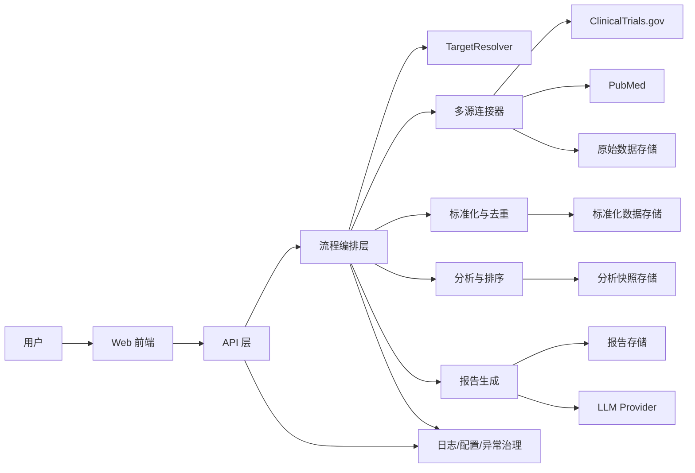

# 医疗情报系统架构设计方案

## 1. 文档目标

本文档基于 [总体技术方案](D:\Project\REFERENCE\medical-intelligence-system\docs\总体技术方案.md) 与 [医疗情报系统需求描述](D:\Project\REFERENCE\medical-intelligence-system\docs\医疗情报系统需求描述.md)，给出一份可直接指导实现的架构设计方案，重点说明：

- 系统整体架构与分层
- 模块拆分与模块职责
- 关键技术选型及理由
- 数据从采集到报告输出的完整流转过程
- 大结果集与 LLM 上下文窗口治理策略
- 后续新增数据源时的扩展方式

本文档面向 V1 原型系统，优先保证主链路跑通、证据可追溯、结构可扩展。

## 2. 设计目标与范围

### 2.1 V1 目标

V1 聚焦一个“可工作的科研情报原型”：

- 用户输入靶点名称，如 `HER2`、`PD-L1`、`KRAS G12C`
- 系统自动查询 `ClinicalTrials.gov` 与 `PubMed`
- 对多源结果进行标准化、去重、排序和统计
- 使用 LLM 生成结构化竞品情报报告
- 通过 Web/API 对外提供查询与展示能力

### 2.2 V1 暂不纳入

- 独立异步任务队列
- 多租户与权限体系
- 历史版本对比
- PDF 导出与复杂可视化
- 大规模第三方商业数据源集成

这些能力在架构上预留扩展点，但不在首版强制实现。

### 2.3 技术选型及理由

为保证 V1 原型开发效率、结构清晰度和后续扩展能力，建议采用以下技术栈：

| 技术领域 | 推荐选型 | 选型理由 |
| --- | --- | --- |
| 后端框架 | `Python 3.12 + FastAPI` | Python 生态适合数据抓取、文本处理和 LLM 集成；FastAPI 类型标注清晰、接口开发快、便于后续扩展异步接口 |
| HTTP 客户端 | `httpx` | 同时支持同步与异步调用，便于统一处理超时、重试和连接池 |
| 数据建模 | `Pydantic` | 适合定义请求体、响应体和领域对象，便于标准化层做字段约束与校验 |
| ORM / 持久化 | `SQLAlchemy` | 便于将原始记录、标准化记录、报告对象持久化，后续从 SQLite 切换到 PostgreSQL 成本较低 |
| 本地数据库 | `SQLite` | V1 部署简单、零运维、适合作为原型期缓存和报告存储；后续可平滑替换为更强数据库 |
| 前端框架 | `React + Vite` | 页面交互足够灵活，Vite 启动和构建速度快，适合快速搭建原型界面 |
| Markdown 渲染 | `react-markdown` 或同类方案 | 适合直接展示报告正文，和 Markdown 报告产物天然匹配 |
| LLM 接入 | `LLMClient + Provider` 抽象，首版接入 `OpenRouter` | 避免业务逻辑直接绑定单一模型厂商，便于后续切换到 OpenAI 或其他兼容 Provider |
| 配置管理 | `.env + pydantic-settings` | 统一读取环境变量，避免 API Key 硬编码，适合 Docker 注入配置 |
| 日志 | Python `logging` | 原生可用，易于输出结构化字段，满足 V1 排障需求 |
| 测试 | `pytest` | 社区成熟，适合连接器、标准化和报告生成链路测试 |
| 容器化 | `Docker + Docker Compose` | 统一开发与部署环境，降低本地环境差异，便于组织前后端和持久化卷 |

各项技术的设计定位如下：

- 后端采用 `FastAPI`，是因为本系统核心难点在多源采集、数据规整和流程编排，而不是复杂事务型业务；Python 更适合快速交付这一类原型。
- 存储优先使用 `SQLite`，是因为 V1 重点在“跑通链路”和“可追溯”，无需过早引入独立数据库运维成本。
- 前端选择 `React + Vite`，是为了快速实现输入、生成状态、报告渲染和来源展示几个核心页面。
- LLM 接入必须做 Provider 抽象，因为科研情报场景后续很可能需要替换模型、切换供应商或控制成本。
- Docker 作为默认部署方式，是为了让本地开发、演示环境和后续交付环境保持一致，并为新增 `worker` 容器预留空间。

## 3. 架构原则

### 3.1 模块化单体优先

V1 采用“前后端分离 + 后端模块化单体”的形态：

- 前端提供轻量交互与报告展示
- 后端负责流程编排、数据处理、模型调用和存储
- 模块之间通过清晰接口解耦，为后续拆分服务预留空间

这样可以在控制复杂度的前提下，兼顾原型开发效率和后续演进能力。

### 3.2 证据优先于结论

报告中的判断必须能够回溯到原始来源，因此系统内部采用分层数据模型：

- 原始记录层：保存外部数据源返回的完整证据
- 标准化记录层：面向跨源处理的统一表示
- 分析输入层：面向任务的聚合与统计结果
- 报告产物层：最终结构化报告

### 3.3 程序负责统计，LLM 负责归纳

对数量统计、阶段分布、来源计数、时间排序等确定性问题，优先由程序计算；对综述、归纳、竞争判断等需要语言组织的问题，再交给 LLM 完成，以降低幻觉风险。

### 3.4 扩展优先于写死

- 数据源通过 Connector 插件式接入
- 模型服务通过 Provider 抽象层接入
- 标准化层允许字段覆盖度不一致
- 报告生成按阶段拆分，避免单体 Prompt 失控

## 4. 总体架构

### 4.1 逻辑架构图



### 4.2 部署形态

- 前端：`React + Vite`
- 后端：`FastAPI`
- 存储：`SQLite`
- LLM：通过统一 `LLMClient` 调用外部模型服务
- 部署：优先采用 `Docker` / `Docker Compose`

V1 采用单进程后端即可满足需求；后续若查询耗时增长，可平滑演进为“API + Worker”模式。

### 4.3 Docker 部署建议

建议使用多容器开发与部署方式：

- `frontend` 容器
  - 承载 Web 页面与静态资源服务
- `backend` 容器
  - 承载 FastAPI、流程编排、连接器、报告生成逻辑
- `sqlite-volume`
  - 通过挂载卷保存数据库文件、缓存和报告产物

建议补充以下交付物：

- `backend/Dockerfile`
- `frontend/Dockerfile`
- `docker-compose.yml`
- `.dockerignore`

设计注意点：

- SQLite 文件必须挂载到宿主机卷，避免容器重建后数据丢失
- `.env` 通过 Compose 注入，不把 API Key 打进镜像
- 前后端容器通过内部网络通信，前端只暴露必要端口
- 后续若引入异步任务，可在 Compose 中增加 `worker` 容器而不改主架构

## 5. 模块拆分与职责

## 5.1 建议代码目录

```text
medical-intelligence-system/
├─ backend/
│  └─ app/
│     ├─ api/
│     ├─ orchestration/
│     ├─ domain/
│     ├─ connectors/
│     ├─ normalize/
│     ├─ analyze/
│     ├─ report/
│     ├─ llm/
│     ├─ repository/
│     └─ infra/
├─ frontend/
│  └─ src/
│     ├─ pages/
│     ├─ components/
│     ├─ services/
│     └─ types/
├─ deploy/
│  ├─ docker-compose.yml
│  └─ env/
└─ docs/
```

## 5.2 后端模块职责

| 模块 | 主要职责 | 核心输入 | 核心输出 |
| --- | --- | --- | --- |
| `api` | 提供 REST 接口、参数校验、响应封装、错误码映射 | HTTP 请求 | 报告结果、来源列表、错误响应 |
| `orchestration` | 编排一次完整的报告生成流程，控制执行顺序与容错策略 | `target`、查询参数 | 完整报告、执行上下文、warning |
| `domain` | 定义核心实体、枚举、值对象和跨模块协议 | 各模块共享数据 | 统一业务模型 |
| `connectors` | 对接外部数据源，处理查询构建、分页、重试、原始响应解析 | 查询上下文 | `RawRecord` 列表 |
| `normalize` | 标准化字段、去重、别名映射、跨源关联线索抽取 | `RawRecord` | 标准化记录 |
| `analyze` | 统计、排序、筛选、证据裁剪、任务化聚合 | 标准化记录 | `AnalysisReadyBundle` |
| `report` | 分阶段生成报告、拼装 Markdown、组织来源引用 | `AnalysisReadyBundle` | `ReportDocument` |
| `llm` | 提供统一模型调用接口，屏蔽具体厂商差异 | Prompt、模型参数 | 结构化生成结果 |
| `repository` | 负责对 SQLite 的持久化读写，封装原始数据、标准化数据、报告数据访问 | 领域对象 | 持久化结果 |
| `infra` | 配置、日志、数据库初始化、异常定义、重试与超时策略 | 环境变量、基础设施依赖 | 横切能力 |

## 5.3 关键模块细分

### 5.3.1 `api`

建议拆为以下子模块：

- `routes/reports.py`
  - `POST /api/reports`：创建并返回报告
  - `GET /api/reports/{id}`：查询报告详情
  - `GET /api/reports/{id}/sources`：查询证据来源
- `schemas/`
  - 定义请求体与响应体
- `deps/`
  - 注入 settings、数据库会话、服务对象
- `error_handlers.py`
  - 统一异常转 HTTP 响应

职责边界：

- 只处理协议层问题，不写业务规则
- 不直接拼 Prompt，不直接访问外部数据源

### 5.3.2 `orchestration`

建议以 `ReportGenerationService` 作为核心编排入口，下设：

- `TargetResolver`
  - 解析用户输入、补充别名与同义词
- `FetchPipeline`
  - 调用多个 Connector 获取原始数据
- `NormalizePipeline`
  - 执行标准化、关联和去重
- `AnalysisPipeline`
  - 完成排序、统计和证据选择
- `ReportPipeline`
  - 分阶段调用报告生成逻辑

职责边界：

- 控制主流程与异常兜底
- 汇总 warnings
- 决定“部分失败仍继续”的策略

### 5.3.3 `domain`

建议沉淀以下核心对象：

- `TargetQuery`
  - 表示一次靶点查询请求
- `RawRecord`
  - 表示外部来源返回的原始记录
- `NormalizedTrialRecord`
  - 临床试验标准化记录
- `NormalizedLiteratureRecord`
  - 文献标准化记录
- `AnalysisReadyBundle`
  - 面向报告生成的任务化聚合对象
- `ReportDocument`
  - 最终报告对象
- `SourceRef`
  - 报告中的来源引用信息
- `WarningItem`
  - 数据缺失、来源失败、裁剪提示等告警项

职责边界：

- 统一跨模块语言
- 保证各层之间数据传递稳定
- 让模块依赖“业务协议”，而不是依赖具体实现

### 5.3.4 `connectors`

建议一个数据源对应一个连接器目录：

- `clinicaltrials/`
  - `client.py`
  - `mapper.py`
  - `connector.py`
- `pubmed/`
  - `client.py`
  - `mapper.py`
  - `connector.py`

公共抽象：

- `BaseConnector`
  - `search(query: TargetQuery) -> list[RawRecord]`
- `ConnectorResult`
  - 返回记录、耗时、warning、分页统计

模块职责：

- 处理数据源专属查询语法
- 处理分页、限流、重试
- 保存原始载荷，不在此阶段进行激进过滤

扩展规则：

- 新增数据源时，只新增一个 Connector 与其 mapper
- 编排层注册新 Connector 后即可加入主链路

### 5.3.5 `normalize`

建议拆为：

- `trial_normalizer.py`
- `literature_normalizer.py`
- `entity_resolver.py`
- `deduplicator.py`
- `linker.py`

模块职责：

- 将原始字段映射为稳定的中间结构
- 统一日期、阶段、状态、机构名称等枚举
- 提取 DOI、PMID、NCT 号等跨源关联线索
- 合并重复记录，保留来源映射关系

设计原则：

- 标准化层不等同于分析层
- 允许字段覆盖不齐，缺失值可显式为空
- 保留 `source_name`、`source_id`、`source_url` 以支持追溯

### 5.3.6 `analyze`

建议拆为：

- `scoring.py`
  - 计算靶点匹配度、新近性、阶段权重等分数
- `stats.py`
  - 计算阶段分布、申办方分布、年份趋势等统计
- `selector.py`
  - 选择纳入 LLM 的高价值证据
- `bundle_builder.py`
  - 组装 `AnalysisReadyBundle`

模块职责：

- 将“全量标准化记录”转成“可分析、可生成、可解释”的输入
- 控制 LLM 上下文规模
- 输出 coverage、缺失项与数据质量提示

### 5.3.7 `report`

建议按四个章节拆分：

- `target_overview_generator.py`
- `pipeline_overview_generator.py`
- `research_update_generator.py`
- `competition_assessment_generator.py`
- `markdown_renderer.py`

模块职责：

- 为每个章节构造 Prompt
- 控制章节输入只消费 `AnalysisReadyBundle`
- 拼装最终 Markdown
- 生成章节级引用与 warning 摘要

建议规则：

- 先章节生成，再汇总总述
- 每章输入数据单独裁剪，不共享超长上下文
- 统计图表占位信息可在 V2 扩展

### 5.3.8 `llm`

建议结构：

- `client.py`
  - `LLMClient`
- `providers/base.py`
  - `BaseLLMProvider`
- `providers/openrouter.py`
  - `OpenRouterProvider`
- `prompting/`
  - Prompt 模板与输出解析

模块职责：

- 屏蔽不同模型厂商接口差异
- 提供统一超时、重试、温度等参数控制
- 支持结构化输出约束

设计要求：

- 业务模块只依赖 `LLMClient`
- Provider 可替换，避免业务层写死供应商

### 5.3.9 `repository`

建议拆为：

- `raw_record_repository.py`
- `normalized_record_repository.py`
- `report_repository.py`
- `execution_log_repository.py`

模块职责：

- 原始响应持久化
- 标准化记录与分析快照缓存
- 报告与来源引用存储
- 支持按 `target` + 时间的查询与缓存复用

### 5.3.10 `infra`

建议拆为：

- `settings.py`
- `db.py`
- `logging.py`
- `exceptions.py`
- `http.py`

模块职责：

- 统一配置加载
- 管理数据库连接与会话
- 输出结构化日志
- 定义通用异常和错误码
- 管理外部 HTTP 客户端的超时与重试

可额外包含：

- `container.py`
  - 容器运行时环境探测与路径配置
- `storage_paths.py`
  - 统一管理 Docker 挂载目录、数据库文件路径、缓存目录

## 5.4 前端模块职责

| 模块 | 主要职责 |
| --- | --- |
| `pages/ReportCreatePage` | 输入靶点、提交查询、展示运行状态 |
| `pages/ReportDetailPage` | 渲染报告正文、来源证据和 warning |
| `components/TargetSearchForm` | 靶点输入、可选 indication、刷新选项 |
| `components/ReportViewer` | Markdown 渲染与章节导航 |
| `components/SourceEvidenceList` | 展示试验与文献来源列表 |
| `services/reportApi` | 封装后端接口调用 |
| `types/` | 定义前后端共享的接口类型 |

前端原则：

- 不承载业务决策逻辑
- 不直接访问外部数据源
- 所有生成状态由后端返回并驱动展示

## 6. 核心数据模型设计

## 6.1 数据分层

```text
TargetQuery
   -> RawRecord
   -> NormalizedTrialRecord / NormalizedLiteratureRecord
   -> AnalysisReadyBundle
   -> ReportDocument
```

## 6.2 核心对象职责

| 对象 | 职责 |
| --- | --- |
| `TargetQuery` | 保存用户输入、别名、适应症上下文和查询时间 |
| `RawRecord` | 保留真实原始载荷，用于调试与证据回溯 |
| `NormalizedTrialRecord` | 面向临床试验分析的统一结构 |
| `NormalizedLiteratureRecord` | 面向文献分析的统一结构 |
| `AnalysisReadyBundle` | 汇总选中证据、统计结果、coverage 与 warning |
| `ReportDocument` | 保存最终 Markdown、章节摘要、来源引用和时间戳 |

## 6.3 字段策略

V1 不强行冻结所有标准化字段，而是采用“两层稳定、字段渐进冻结”的方式：

- 先冻结对象边界与职责
- 再根据任务需要逐步冻结高价值字段

优先稳定的字段类别包括：

- 来源追溯字段：`source_name`、`source_id`、`source_url`
- 时间字段：发布时间、注册时间、更新日期
- 研发阶段与状态字段
- 申办方、干预措施、疾病适应症
- 文献标题、摘要、期刊、关键词、MeSH
- 关联线索字段：`doi`、`pmid`、`nct_id`

## 7. 数据流转过程

## 7.1 主流程

1. 用户在前端输入靶点并发起报告生成请求。
2. `api` 接收请求并创建 `TargetQuery`。
3. `TargetResolver` 扩展别名，生成统一查询上下文。
4. `connectors` 分别调用 `ClinicalTrials.gov` 与 `PubMed`，拉取原始记录。
5. 原始响应以 `RawRecord` 形式落库，形成证据底座。
6. `normalize` 将多源结果标准化、去重、关联，并输出标准化记录。
7. `analyze` 完成排序、裁剪、统计与任务聚合，构造 `AnalysisReadyBundle`。
8. `report` 按章节调用 `llm` 生成内容，并由 `markdown_renderer` 拼装 Markdown。
9. `repository` 持久化 `ReportDocument` 与来源引用。
10. `api` 返回报告内容、warning 与来源摘要，前端负责渲染展示。

## 7.2 章节生成流程

为避免一次性输入过大，报告按四段生成：

1. 靶点概述
2. 在研管线概览
3. 近期研究动态
4. 竞争格局判断

每个阶段只读取与当前章节最相关的证据子集，并共享同一个 `AnalysisReadyBundle` 中的程序统计结果。

## 8. 大结果集与上下文窗口治理

当检索结果很多时，系统采用“规则筛选 + 分层摘要 + 分段生成”的策略：

### 8.1 不直接把全量结果喂给 LLM

- 全量原始记录先落库
- 标准化后由程序进行打分和排序
- 仅选择代表性证据进入 LLM 上下文

### 8.2 分源处理

- 临床试验与文献分别排序
- 各自生成中间摘要或结构化要点
- 最后再在报告层进行综合

### 8.3 程序先算，模型后写

以下内容优先由程序直接生成：

- 研发阶段分布
- 主要申办方统计
- 近年文献数量趋势
- 试验状态与入组规模排序

LLM 主要负责：

- 机制概述
- 研究动态解读
- 竞争格局与风险机会判断

### 8.4 裁剪策略

建议默认规则：

- 试验记录按靶点匹配度、阶段、更新时间排序
- 文献按新近性、主题相关性、摘要完整度排序
- 每章只纳入前 N 条最相关证据
- 超出部分记录只保留在来源清单中，不进入 Prompt

## 9. API 设计

| 接口 | 说明 |
| --- | --- |
| `POST /api/reports` | 创建并返回一份新报告 |
| `GET /api/reports/{id}` | 获取报告详情 |
| `GET /api/reports/{id}/sources` | 获取报告关联来源列表 |

建议 `POST /api/reports` 请求体：

```json
{
  "target": "HER2",
  "indication": "breast cancer",
  "force_refresh": false
}
```

返回体建议包含：

- `report_id`
- `target`
- `markdown_content`
- `summary_sections`
- `warnings`
- `source_summary`

## 10. 非功能设计

## 10.1 错误处理

需要显式覆盖：

- 外部 API 超时
- 返回结构变化
- 单一数据源不可用
- 检索结果为空
- LLM 调用失败

处理原则：

- 单源失败不阻断整体流程
- warning 对用户可见，对日志可追踪
- 关键步骤输出请求 ID 与耗时

## 10.2 配置管理

- 所有密钥由环境变量注入
- 使用统一 `settings` 对象读取配置
- 区分开发、测试、生产环境配置

## 10.3 日志与可观测性

日志至少包含：

- `request_id`
- `target`
- 数据源名称
- 拉取记录数
- 纳入分析记录数
- LLM 调用耗时
- warning 数量

## 10.4 缓存策略

V1 可先基于 SQLite 实现轻量缓存：

- 已查询过的靶点可复用最近原始结果
- `force_refresh=true` 时重新拉取
- 后续可扩展为增量更新与任务级缓存

在 Docker 部署下，缓存目录与 SQLite 文件应统一落在挂载卷中，避免容器重启后丢失。

## 11. 扩展设计

## 11.1 新增数据源

新增数据源的标准步骤：

1. 新建一个 Connector 目录
2. 实现 `BaseConnector` 接口
3. 编写源字段到标准化层的 mapper
4. 在编排层注册该 Connector
5. 为标准化与分析模块补充必要字段适配

这样可以做到“新增数据源，不改主流程”。

## 11.2 新增模型服务

新增模型服务的标准步骤：

1. 实现新的 `Provider`
2. 注入到 `LLMClient`
3. 在配置中切换默认 Provider

业务层与报告层无需改动。

## 11.3 演进为异步任务

当报告生成耗时增长时，可将 `orchestration` 从同步调用演进为：

- API 只负责创建任务
- Worker 异步执行抓取、分析和生成
- 前端通过任务状态接口轮询结果

由于当前主流程边界清晰，这种演进不会破坏现有模块划分。

## 12. 主要技术风险与应对

| 风险 | 说明 | 应对策略 |
| --- | --- | --- |
| 靶点别名漏检 | 同一靶点在不同来源中的命名不一致 | 引入 `TargetResolver`，保留原名并扩展别名 |
| 多源字段差异大 | 不同来源字段结构与语义差异明显 | 采用 `Raw -> Normalized -> Analysis` 三层模型 |
| LLM 幻觉 | 模型总结可能偏离证据 | 统计由程序计算，报告保留来源引用 |
| 上下文超限 | 文献和试验结果可能非常多 | 排序裁剪、分源摘要、按章节生成 |
| 单一来源失败 | 外部接口波动导致流程中断 | 允许部分失败，输出 warning 并继续生成 |
| Provider 锁定 | 业务逻辑直接依赖单一模型厂商 | 抽象 `LLMClient` 与 Provider 层 |

## 13. 实施建议

建议按以下顺序落地：

1. 先完成 `domain`、`connectors`、`normalize` 的主干
2. 再打通 `orchestration + report + llm`
3. 最后补充 `api`、前端展示和缓存能力

对应的最小可运行链路为：

- 靶点输入
- 双源采集
- 标准化与去重
- 四章节 Markdown 报告输出
- 页面展示与来源追溯

## 14. 结论

本方案建议以“模块化单体 + 多连接器 + 分层数据模型 + 分阶段报告生成”作为 V1 的正式架构路线。

其核心价值在于：

- 能快速交付一个可运行原型
- 模块职责清晰，便于并行开发
- 证据可追溯，适合科研情报场景
- 为新增数据源、切换模型服务和异步化演进预留空间

相较于仅有的初步 sketch，本方案进一步明确了实现边界、模块职责、数据流和扩展方式，可以直接作为后续编码与任务拆分的依据。
