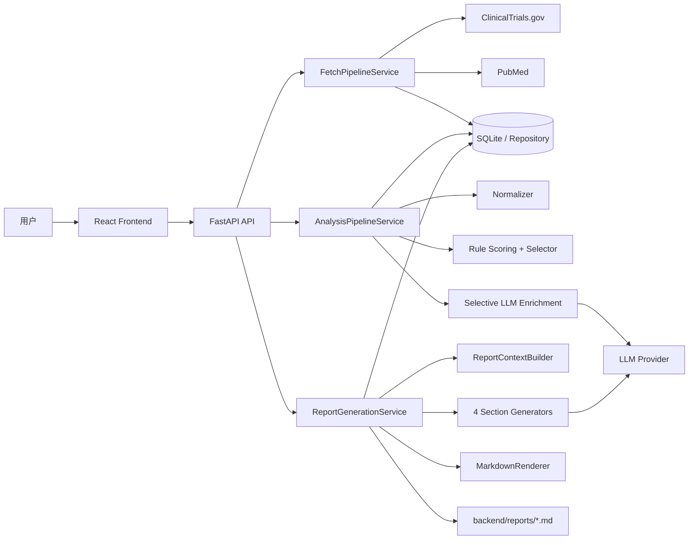
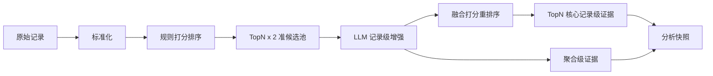

# 医疗情报系统

基于开放医学数据源与 LLM 增强的情报分析系统

  作者：王张立

---

# 演示目录

1. 需求背景
2. 系统目标
3. 架构设计*
4. 关键技术决策
5. 未来优化方向

---
layout: section
---

# 需求背景

---

# 需求背景

## 为什么需要科研情报智能体

- 早期药物研发部门在靶点立项前，需要快速掌握临床试验、近期文献与竞品格局。
- 信息分散在 ClinicalTrials.gov、PubMed 等数据库中，检索形式各异。
- 现有流程依赖人工检索、摘录、去重与整理，耗时长、标准不统一，且难以复用历史中间结果。
- 医学情报报告不能只给“生成文本”，还需要保留可追溯的原始证据与结构化分析过程。

---

# 需求背景

## 核心痛点

- 检索范围广，人工很容易遗漏关键试验或近期文献。
- 多源数据异构，直接拼接文本会损失结构化字段价值。
- 报告结论需要能回溯到具体试验、文献和字段来源。

## 期望变化

- 从“人工查库”变成“输入靶点后自动采集”。
- 从“复制摘要”变成“结构化治理后再分析”。
- 从“一次性写报告”变成“先沉淀证据，再生成报告”。
- 从“个人经验口径”变成“可复用、可扩展的分析链路”。

---
layout: section
---
# 系统目标
---

# 系统目标

## 系统核心能力

用户输入一个靶点名称，例如 `HER2`、`PD-L1`、`KRAS G12C`，系统自动完成：

1. 从多源数据采集在研临床试验信息与相关学术文献与元数据。
3. 利用大语言模型对采集到的数据进行分析与归纳。
4. 生成包含靶点概述、在研管线、近期研究动态和竞争格局判断的结构化报告。

## 端到端能力闭环

---

# 系统目标

## 报告输出目标

- **靶点概述**：补充靶点基本信息、作用机制和疾病相关背景。
- **在研管线概览**：统计研发阶段、试验状态、申办方、干预方式与地域分布。
- **近期研究动态**：提炼关键文献发现、研究类型、主题词和临床关联线索。
- **竞争格局判断**：综合临床试验和文献证据，给出机会、风险与竞争态势判断。

---
layout: section
---

# 架构设计

---

# 架构设计

## 架构总览

- 后端以管道模式拆分主流程：采集管道、分析管道、报告生成管道。
- 数据源通过 connector 扩展，当前接入 ClinicalTrials.gov 与 PubMed，新增来源不侵入主编排。
- LLM 能力通过 `LLMClient + Provider` 抽象扩展，当前实现 OpenRouterProvider。
- 原始记录先落库，再执行标准化、规则打分、可选 LLM 增强和分析快照构建。
- 报告阶段基于分析快照按四个章节生成 Markdown 形式的报告，并保存来源引用、warning 和本地报告文件。

---

# 架构设计

## 架构图

---

# 架构设计

## 基础层设计 - 原始数据检索层设计
### 批量执行
- 分批次分页从原始数据库查询数据，保证全面且不触发数据提供方的限流策略。
### 检索条件
- 检索策略原则：优先检索“近期、临床相关、信息完整”的高价值候选集。
- ClinicalTrials.gov：默认筛选 II/III 期、干预性研究、最近一年更新的试验、默认状态限定为 `RECRUITING`、`ACTIVE_NOT_RECRUITING`、`COMPLETED`。
- PubMed：默认检索最近一年且有摘要的临床试验类、试验 II/III 期文献。
- 保留最大检索数量上限的配置。
### 扩展性
- 使用连接器整合多源数据，各源数据具体实现限制在各自连接器内部。
### 缓存
- 已检索过的原始数据进行缓存，不再会落库。

---

# 架构设计

## 基础层设计 - LLM 能力层设计
### 扩展性
- 使用LLM Provider设计而不是直接连入某个大模型提供商。假设后续更换模型平台时，优先新增 Provider 实现，保持分析和报告业务代码稳定；后续兼容 fallback 策略。
### 结构化输出能力
- 配置并使用具有结构化输出能力的 LLM，能够输出带有结构化模式的JSON结果，降低链路中的数据失真可能性。

---

# 架构设计

## 数据分析层设计
### 思路
- 分析层先把多源异构数据标准化为稳定业务对象。
- 再通过规则评分、筛选准候选集、记录级 LLM 增强、重排序、筛选候选集，把大原始检索集压缩为高支持性的核心证据。
- 报告生成的输入不是原始全文，而是治理与增强后的试验和文献记录。
- 这是一套分而治之流程：先进行记录级的四章节理解，后交给报告器进行归纳总结。
### 实施步骤

---

# 架构设计

## 数据分析层设计
### 缓存设计
- 标准化缓存：按 `trial_key` / `literature_key` 复用最近的标准化结果。
- LLM 增强缓存：按 key 查找最近增强结果，避免同一试验或文献反复调用模型。
- 分析阶段产物进行固化，报告层可以重复读取，不必每次重建分析结果。

---

# 架构设计

## 报告生成层设计

- 报告层不直接读取原始记录，而是从持久化的分析快照和 LLM 增强结果构造章节上下文。
- 四个章节分别使用不同的事实依据/上下文独立生成：靶点概述、在研管线概览、近期研究动态、竞争格局判断。
- `ReportContextBuilder` 只把当前章节需要的内容、事实、全局信息传给报告生成器。
- 章节生成失败时回退为基于结构化事实的最小摘要，不让单章失败拖垮整份报告。
- `MarkdownRenderer` 负责拼装最终报告，`ReportSourceRef` 保存可追溯的章节引用来源。

---

# 架构设计

## 领域模型设计

- 查询与采集层：`TargetQuery`、`FetchRun`、`RawRecord` 描述用户意图、任务状态和原始证据。
- 标准化实体层：`NormalizedTrialRecord`、`NormalizedLiteratureRecord` 抽取可计算、可追溯的医学字段。
- 语义增强层：`TrialLLMEnrichment`、`LiteratureLLMEnrichment` 补充记录级摘要、证据片段和语义评分。
- 分析聚合层：`AnalysisReadyBundle`、`SectionInputBundle` 按报告章节组织事实、证据和 coverage。
- 报告产物层：`ReportDocument`、`ReportSourceRef` 约束最终输出，并保存章节级来源引用。

---
layout: section
---

# 关键技术决策

---

# 关键技术决策

## 决策总览

- 用分而治之拆解报告生成：检索、排序、筛选、增强、重排、章节生成。
- 不引入向量数据库：当前输入是靶点，不是开放式自然语言问题。
- 优先保留结构化语义：ClinicalTrials.gov 返回 JSON，PubMed 返回 XML。
- 领域模型面向最终报告章节设计，并要求值对象可回溯到原始证据。
- 缓存作为必要能力，用于降低重复处理、LLM 调用成本和外部波动影响。

---

# 关键技术决策

## 从大量数据提炼核心信息的方式

- 先检索大范围数据，再通过规则进行筛选高质量信息，最后生成结果。
- 由于任务类似文献综述，每条结果都需要对报告目标有高支持性的事实总结，因此采用LLM对记录级结果进行增强。

- 分而治之思想 - 把智能报告的生成任务拆分为四个特定章节的生成任务，再拆分为每个章节细分内容的生成任务。

---

# 关键技术决策

## 规则与 LLM 的分工

- **规则负责规模化治理**：提取靶点匹配、适应症匹配、研发阶段、试验状态、文献新近性、论文类型、MeSH 与 NCT 线索等结构化数据。
- **LLM 负责记录级增强**：主要从文本内容提炼事实摘要、证据片段、主题线索和章节相关性判断。
- **融合重排负责收敛结果**：规则分为主，LLM 分为辅，兼顾可解释性与语义理解能力。
- **章节生成负责表达**：程序先计算统计事实与候选证据，LLM 再完成归纳和论述组织。

---

# 关键技术决策

## 是否使用向量数据库

结论：不使用。

- 系统检索目标明确，输入是靶点名称和别名，不是任意自然语言问题。
- ClinicalTrials.gov 与 PubMed 已提供成熟检索能力，关键词稀疏检索足以覆盖当前核心场景。
- 原始结果本身是结构化数据，直接向量化 JSON / XML 会损失字段层级、来源语义和证据可追溯性。
- 如果不先进行结构化信息提取而是直接将数据向量化，会导致损失蕴含在结构中的珍贵语义。

---

# 关键技术决策

## 领域模型设计原则
- 领域模型服务于最终智能报告生成的四个章节。
- 领域模型需要保证尽量提取服务于章节目标的有效信息。
- 领域模型实体的值对象必须最终来源于初始的检索数据源，以保证最终分析结果的强证据性。
- LLM 增强结果作为中间补充语义资产，而不是替代原始规范化证据。

---
layout: section
---

# 未来优化方向

---

# 未来优化方向

1. 对规范化筛选的规则、TopN的裁剪规则、打分规则进行参数微调，设置为可配置化。
2. 来源数据改为离线全量存储与增量更新，增强检索稳定性与分析可用性；记录级LLM增强的数据集改为离线构建，可显著减少执行在线任务时的等待时间。或者将在线检索的IO任务改为异步任务。
3. 再审查领域模型设计，增强通用性与信息聚合度。
4. 增强缓存功能，在报告层引入更细粒度的缓存，例如章节级缓存或Prompt结果缓存。
5. 存储层迁移到PostgresSQL。
6. 增加靶点信息数据源(UniProt)，增强最终报告中对靶点概览的介绍。

---
layout: end
---

# Q&A

谢谢。
